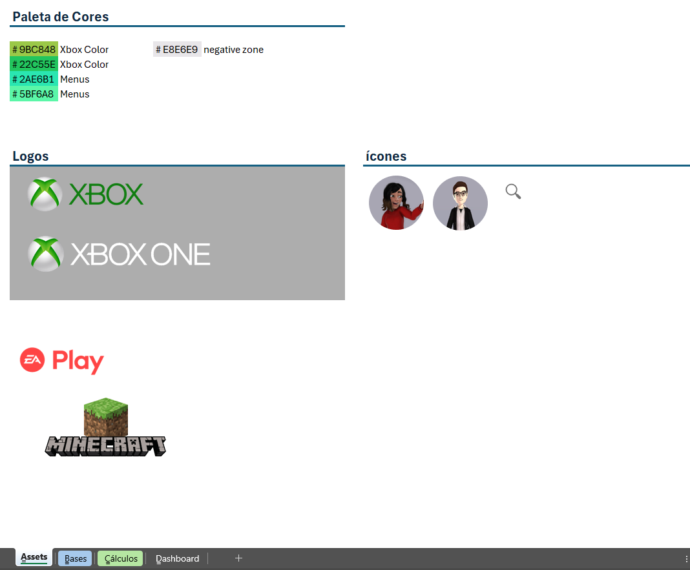
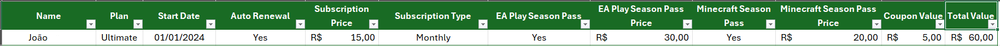
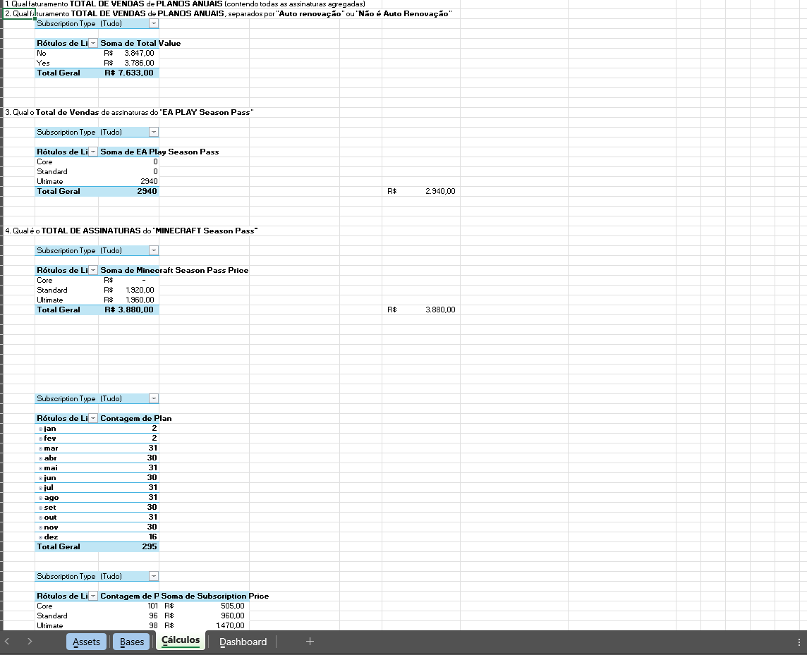
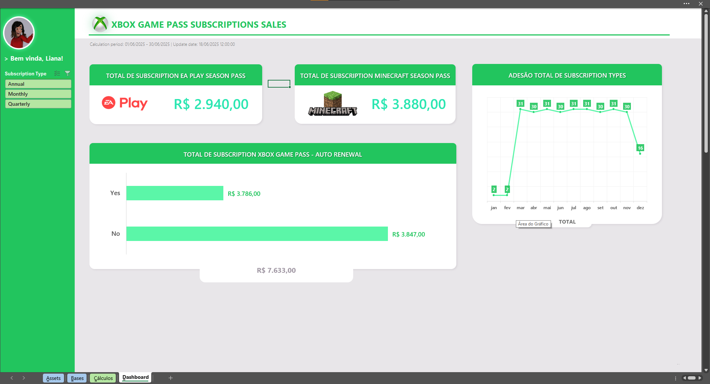

***DESAFIO DE CURSO DIO - Projeto de Excel ✒***         
****DASHBOARD DE VENDAS****

## 📄 Descrição

Este projeto foi desenvolvido com o intuito de criar um dashboard de vendas, ajudando analistas a entender os índices de assinaturas de produtos do XBOX (dados fictícios, apenas para exemplificar), e aplicar conceitos de Excel de criação de *Dashboards* e transformação de dados em informações claras e uteis para tomada de descisão.  

Nesta planilha temos dois gráficos, base de dados, tabelas de cálculos e também *assets* que fazem parte para a criação do Dashboard.   
Valew ressaltar o contexto que foi entregue neste projeto:   
> Alguém da gerência do departamento de vendas da "XBOX" pediu a criação de um *Dashboard* sobre o "XBOX GAME PASS Subscription Sales" ou "Vendas de assinaturas do XBOX GAME PASS", e que neste Dashboard precisa responder quatro pontos:
> Qual faturamento TOTAL DE VENDAS de PLANOS ANUAIS (contendo todas as assinaturas agregadas);
> Qual faturamento TOTAL DE VENDAS de PLANOS ANUAIS, separados por "Auto renovação" ou "Não é Auto Renovação";
> Qual o Total de Vendas de assinaturas do "EA PLAY Season Pass";
> Qual é o TOTAL DE ASSINATURAS do "MINECRAFT Season Pass".   

> Precisa conter gráficos dínamicos e interativos, que possa permitir uma análise eficaz do desempenho de vendas e para a tomada de decisões baseadas em dados. 

Este [projeto](ProjetoEXCEL/Dashboard%20de%20Vendas%20-%20XBOX.xlsx) pode ser usado como base para futuras expansões e personalizações. 

## ⚙ Estrutura

Neste projeto, foi utilizado o **Método ABCDE** de organização, compartilhado pelo professor do curso. Na qual separa as tarefas de criação de projetos/Dashboards para melhor eficiência na criação e organização.   
Os seguintes painéis seria:
1. [ASSETS](#assets): Recursos essenciais e complementares que serão utilizados no projeto, isso inclui imagens, vídeos, gifs e paletas de cores;
2. [BASES](#bases): Base de dados necessários para que a análise seja feita sobre ele;
3. [CÁLCULOS](#cálculos): Campo que processa a base de dados para transformar em informações;

5. [*DASHBOARD*](#dashboard): Painel visual para análises claras. 

Para os usuários que irão trabalhar os dados principais de vendas, todas as funcionalidades estão no painel de ***DASHBOARD***.   

## 🧱 Passo a Passo

### ASSETS

Neste primeiro painel é onde separamos os recursos que iremos utilizar em todo o projeto, especialmente para os painéis que o usuário/analista irá trabalhar. Tais recursos seria: 

#### Paleta de cores 
  1. $\color{#9BC848}{\textsf{Xbox Color 1}}$: #9BC848;
  2. $\color{#22C55E}{\textsf{Xbox Color 2}}$: #22C55E;
  3. $\color{#2AE6B1}{\textsf{Menus 1}}$: #2AE6B1;
  4. $\color{#5BF6A8}{\textsf{Menus 2}}$: #5BF6A8.

#### Logos 
  1. XBOX: Logo do segmento de games da empresa; 
  2. XBOX ONE: Produto da empresa, opicional; 
  3. EA Play: Assinatura adicional e opicional do Game Pass para jogos da *Eletronic Arts*;
  4. Minecraft: Logo do jogo sandbox, que nele contém um adicional do Game Pass chamado "*Minecraft Season Pass Price*";  

#### Ícones
  1. Usuários: Ícone de pessoa a depender do usuário/analista/gerente;
  2. Lupa: Ícone de Pesquisa/Filtragem;   

   

### BASES

No painel de **BASES** estão todos os dados ligados as vendas de assinaturas do "GAME PASS". Nesta tabela temos 295 ítens/linhas, 1 cabeçalho e 13 colunas:   
1. Subscriber ID; 
2. Name	Plan; 
3. Start Date; 
4. Auto Renewal; 
5. Subscription Price; 
6. Subscription Type; 
7. EA Play Season Pass; 
8. EA Play Season Pass Price; 
9. Minecraft Season Pass; 
10. Minecraft Season Pass Price; 
11. Coupon Value; 
12. Total Value.   

   

### CÁLCULOS

Aqui são feito os **CÁLCULOS** puxados na base de dados (Painel **BASES**), na qual temos 4 tabelas dinâmicas. 
Cada uma respondendo as perguntas da ***Gerência*** sobre as vendas. Mas essas informações são mais claras na tabela de **DASHBOARD**.   

   

   
### DASHBOARD

E por fim, temos a tabela principal. Aqui o usuário pode entender com mais clareza os resultados de vendas das assinaturas do XBOX GAME PASS (valores em R$).   
Especificamente com os totais de assinaturas do "EA Season Pass" e "Minecraft Season Pass". 

Temos uma segmentação de dados que serve como filtro para esses dados, dividios em 3 opções:
- Anuual: Valores anuais; 
- Monthly: Valores mensais; 
- Quarterly: Valores trimestrais. 
> OBS: É possível habilitar para selecionar mais de uma opção. Basta clicar no ícone entre o "Subscription Type" e "Limpar Filtro". 

Temos o total de dois Gráficos e dois visualizadores de totais de vendas. 
1. TOTAL DE SUBSCRIPTION EA PLAY SEASON PASS: Total de inscrições da coluna "EA Season Pass". Temos uma tabela de ; 
2. TOTAL DE SUBSCRIPTION MINECRAFT SEASON PASS: Total de inscrições da coluna "Minecraft Season Pass"; 

3. TOTAL DE SUBSCRIPTION XBOX GAME PASS - AUTO RENEWAL: Gráfico com o Valor total de inscrições do XBOX GAME PASS tirados da coluna "TOTAL VALUE", separados por "Auto Renovação" ou "Não é Auto Renovação". 
4. AESÃO TOTAL DE SUBSCRIPTION TYPE: Gráfico com a Soma da contagem de assinaturas realizadas do XBOX GAME PASS, divididas e variadas em mêses.   

   

## 🛠 Considerações Finais

Gostaria de agradecer ao professor da DIO, Felipe Aguiar, pelas aulas fantásticas e explicações sobre o tema.
Futuramente posso fazer um ajuste ou outro no arquivo e em suas funcionalidades, caso necessário.

## 📥 Download da Planilha do Projeto

[📊 Baixar planilha Excel](ProjetoEXCEL/Dashboard%20de%20Vendas%20-%20XBOX.xlsx)

